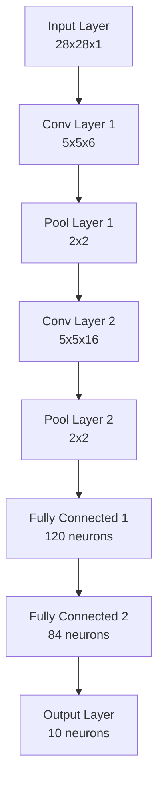

## 1. Cấu trúc tổng quan


## 2. Chi tiết từng layer

### Input Layer
- Kích thước: 28x28x1 (ảnh grayscale)
- Input: MNIST dataset

### Conv Layer 1 (C1)
- Kernel size: 5x5
- Số kernel: 6
- Output size: 24x24x6
- Activation: ReLU

### Pool Layer 1 (S2)
- Pool size: 2x2
- Stride: 2
- Output size: 12x12x6

### Conv Layer 2 (C3)
- Kernel size: 5x5
- Số kernel: 16
- Output size: 8x8x16
- Activation: ReLU

### Pool Layer 2 (S4)
- Pool size: 2x2
- Stride: 2
- Output size: 4x4x16

### Fully Connected Layer 1 (F5)
- Input: 4x4x16 = 256 neurons
- Output: 120 neurons
- Activation: ReLU

### Fully Connected Layer 2 (F6)
- Input: 120 neurons
- Output: 84 neurons
- Activation: ReLU

### Output Layer
- Input: 84 neurons
- Output: 10 neurons (tương ứng với 10 chữ số 0-9)
- Activation: Softmax

## 3. Các tham số quan trọng
```cpp
// Số lượng kernel và kích thước
const int num_kernels_c1 = 6;
const int num_kernels_c2 = 16;
const int kernel_size = 5;

// Kích thước feature map
const int feature_map_size_c1 = 24;  // 28-5+1
const int feature_map_size_c2 = 8;   // 12-5+1

// Số neuron trong các fully connected layer
const int num_neurons_f1 = 120;
const int num_neurons_f2 = 84;
const int num_neurons_output = 10;
```

## 4. Các file trọng số được lưu
```cpp
// Conv Layer 1
weights_c1.bin    // 5x5x6 kernels
bias_c1.bin       // 6 bias values

// Conv Layer 2
weights_c2.bin    // 5x5x16 kernels
bias_c2.bin       // 16 bias values

// Fully Connected Layers
weights_f1.bin    // 256x120 weights
bias_f1.bin       // 120 bias values
weights_f2.bin    // 120x84 weights
bias_f2.bin       // 84 bias values
weights_output.bin // 84x10 weights
bias_output.bin    // 10 bias values
```

## 5. Quá trình training
- Batch size: 100
- Learning rate: 0.01
- Momentum: 0.9
- Số epoch: 10
- Loss function: Cross Entropy
- Optimizer: SGD với momentum


# Để sử dụng dự án với CMake cho việc **train** (huấn luyện) và **test** (kiểm tra với ảnh thực), bạn làm như sau:

---

## 1. Build (biên dịch) với CMake

```bash
cd CUDA
mkdir -p build
cd build
cmake ..
make
```
Sau khi chạy xong, bạn sẽ có 2 file thực thi trong thư mục `build`:
- `cnn_cuda` (dùng để train/huấn luyện)
- `test_real` (dùng để test với ảnh thực)

---

## 2. Huấn luyện mô hình (Train)

Chạy lệnh sau trong thư mục `build`:
```bash
./cnn_cuda
```
- Sau khi chạy xong, các file trọng số như `weights_c1.bin`, `bias_c1.bin`, ... sẽ được tạo ra trong thư mục `CUDA/build` (hoặc cùng thư mục với file thực thi).

---

## 3. Test với ảnh thực (Test)

Giả sử bạn có một ảnh số tay tên là `image.png` (28x28 hoặc ảnh bất kỳ, chương trình sẽ tự resize):

```bash
./test_real image.png
```
- Kết quả sẽ hiển thị xác suất từng số và số được dự đoán.
- Chương trình cũng sẽ hiển thị ảnh gốc và ảnh đã tiền xử lý.

---

### **Lưu ý:**
- Nếu file ảnh không nằm trong thư mục `build`, hãy cung cấp đường dẫn đầy đủ, ví dụ:  
  `./test_real ../image.png`
- Nếu muốn test nhiều ảnh, chỉ cần lặp lại lệnh trên với tên ảnh khác.

---

### **Tóm tắt lệnh sử dụng:**
```bash
# Build
cd CUDA
mkdir -p build
cd build
cmake ..
make

# Train
./cnn_cuda

# Test
./test_real image.png
```
