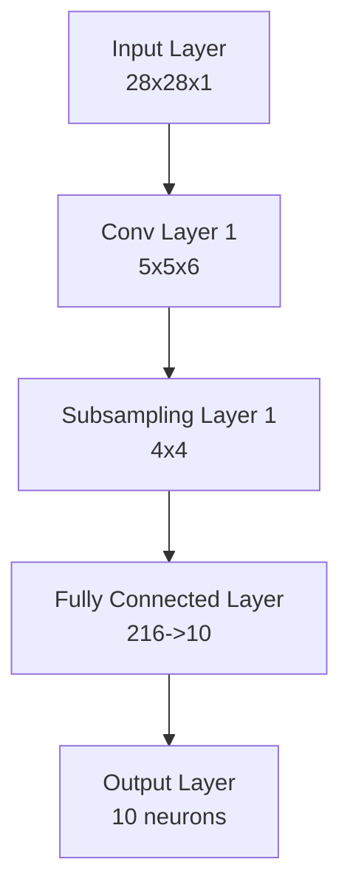

## 1. Cấu trúc tổng quan

```mermaid
graph TD
    A[Input Layer<br/>28x28x1] --> B[Conv Layer 1<br/>5x5x6]
    B --> C[Subsampling Layer 1<br/>4x4]
    C --> D[Fully Connected Layer<br/>216->10]
    D --> E[Output Layer<br/>10 neurons]
```

## 2. Chi tiết từng layer

### Input Layer
- Kích thước: 28x28x1 (ảnh grayscale)
- Input: MNIST dataset
- Không có weights và bias

### Conv Layer 1 (C1)
- Kernel size: 5x5
- Số kernel: 6
- Output size: 24x24x6
- Activation: Step function

### Subsampling Layer 1 (S1)
- Kernel size: 4x4
- Input: 24x24x6
- Output size: 6x6x6
- Activation: Step function

### Fully Connected Layer (F)
- Input: 6x6x6 = 216 neurons
- Output: 10 neurons (tương ứng với 10 chữ số 0-9)
- Activation: Step function

## 3. Các tham số quan trọng
```cpp
// Số lượng kernel và kích thước
const int num_kernels_c1 = 6;
const int kernel_size_c1 = 5;
const int kernel_size_s1 = 4;

// Kích thước feature map
const int feature_map_size_c1 = 24;  // 28-5+1
const int feature_map_size_s1 = 6;   // 24/4

// Số neuron trong fully connected layer
const int num_neurons_f = 216;       // 6x6x6
const int num_neurons_output = 10;
```

## 4. Các file trọng số được lưu
```cpp
// Conv Layer 1
weights_c1.bin    // 5x5x6 kernels
bias_c1.bin       // 6 bias values

// Subsampling Layer 1
weights_s1.bin    // 4x4 kernel
bias_s1.bin       // 1 bias value

// Fully Connected Layer
weights_f.bin     // 216x10 weights
bias_f.bin        // 10 bias values
```

## 5. Quá trình training
- Loss function: Euclidean distance
- Weights và biases được lưu vào các file .bin sau khi training
- Sử dụng backpropagation để cập nhật weights

# Để sử dụng dự án với CMake cho việc **train** (huấn luyện) và **test** (kiểm tra với ảnh thực), bạn làm như sau:

---

## 1. Build (biên dịch) với CMake

```bash
mkdir -p build
cd build
cmake ..
make
```
Sau khi chạy xong, bạn sẽ có 2 file thực thi trong thư mục `build`:
- `cnn_cuda` (dùng để train/huấn luyện)
- `test_real` (dùng để test với ảnh thực)

---

## 2. Huấn luyện mô hình (Train)

Chạy lệnh sau trong thư mục `build`:
```bash
./cnn_cuda
```
- Sau khi chạy xong, các file trọng số như `weights_c1.bin`, `bias_c1.bin`, ... sẽ được tạo ra trong thư mục hiện tại.

---

## 3. Test với ảnh thực (Test)

Giả sử bạn có một ảnh số tay tên là `image.png` (28x28 hoặc ảnh bất kỳ, chương trình sẽ tự resize):

```bash
./test_real image.png
```
- Kết quả sẽ hiển thị xác suất từng số và số được dự đoán.
- Chương trình cũng sẽ hiển thị ảnh gốc và ảnh đã tiền xử lý.

---

### **Lưu ý:**
- Nếu file ảnh không nằm trong thư mục `build`, hãy cung cấp đường dẫn đầy đủ, ví dụ:  
  `./test_real ../image.png`
- Nếu muốn test nhiều ảnh, chỉ cần lặp lại lệnh trên với tên ảnh khác.

---

### **Tóm tắt lệnh sử dụng:**
```bash
# Build
mkdir -p build
cd build
cmake ..
make

# Train
./cnn_cuda

# Test
./test_real image.png
```
